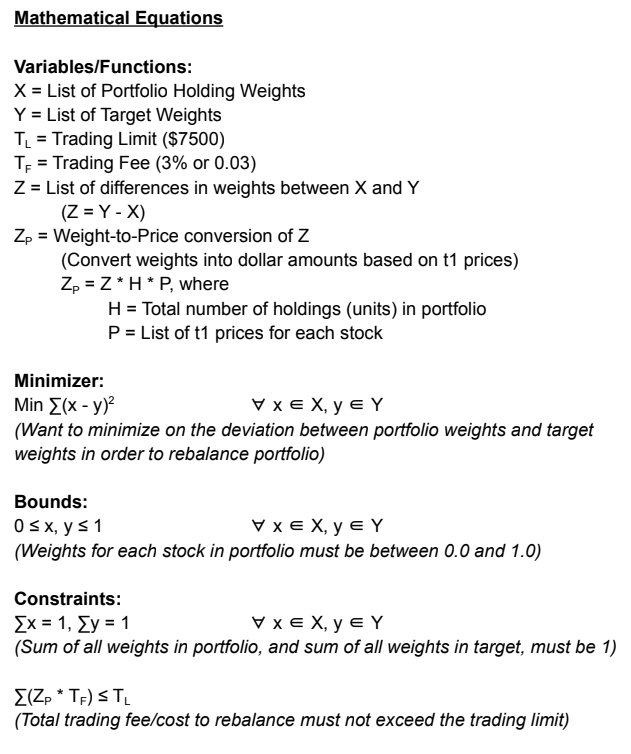
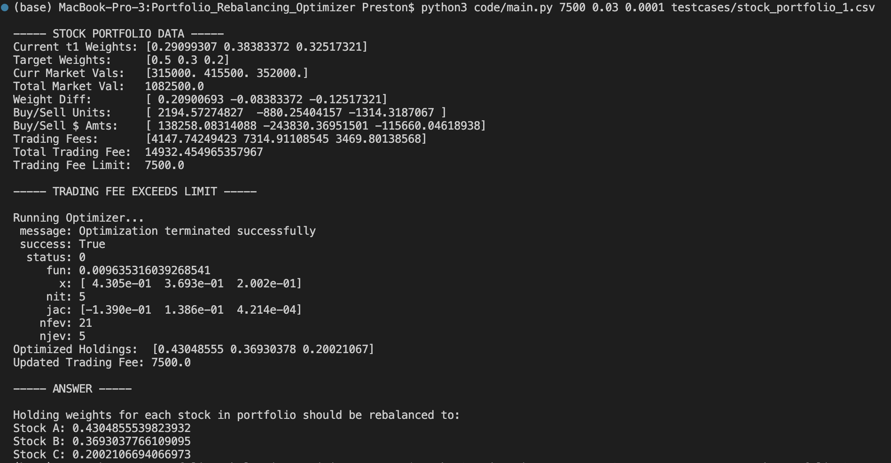
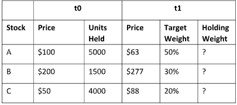

# Portfolio_Rebalancing_Optimizer
Given a stock portfolio that shows number of shares owned and bought at specific price and target weights to adjust to, optimize portfolio by moving number of shares to meet those weights without going over the transaction fee.

**Portfolio Rebalancing**

1. Goal:

    A single portfolio optimization that rebalances the portfolio back to the model (minimize the deviations between portfolio holding and model target weights) while keeping the total trading cost (sum of each holding trading cost) below a certain dollar amount.

    Assumptions &amp; Conditions:

    - The problem can handle any number of securities
    - Stocks can be traded at any fractional unit
    - Shorting is not allowed
    - The trading cost of a holding is 3% of its traded amount
    - The total trading cost cannot exceed $7,500
    - Deviations between portfolio and model weights should be measured as the square of the difference in weights

2. Mathematical Formulation

    

3. Python Program

    To run the code, the program requires 4 arguments:
    - arg1: trading_cost_limit (What is the max allocated trading cost allowed in dollars)
    - arg2: trading_rate (What is the trading rate for every transaction)
    - arg3: tolerance (What is the tolerance for the optimizer)
    - arg4: portfolio_name (csv filename containing the stock portfolio)

    An example of running the code:

    `python3 code/main.py 7500 0.03 0.0001 testcases/stock_portfolio_1.csv`

    - Total trading cost limit is 7500 ($7,500)
    - Trading rate is 0.03 (3%)
    - Tolerance is 0.0001
    - Sample Portfolio to rebalance is in a CSV file named `stock_portfolio_1.csv`

    Code will show the following:
    - Show collected/calculated data from the portfolio, as well as what the trading cost would be to rebalance portfolio to target weights
    - Display whether rebalancing to target weights meet or exceed the limit (Only optimize if limit is exceeded)
    - Show best optimal weights

    Example:

    

4. Outline

    